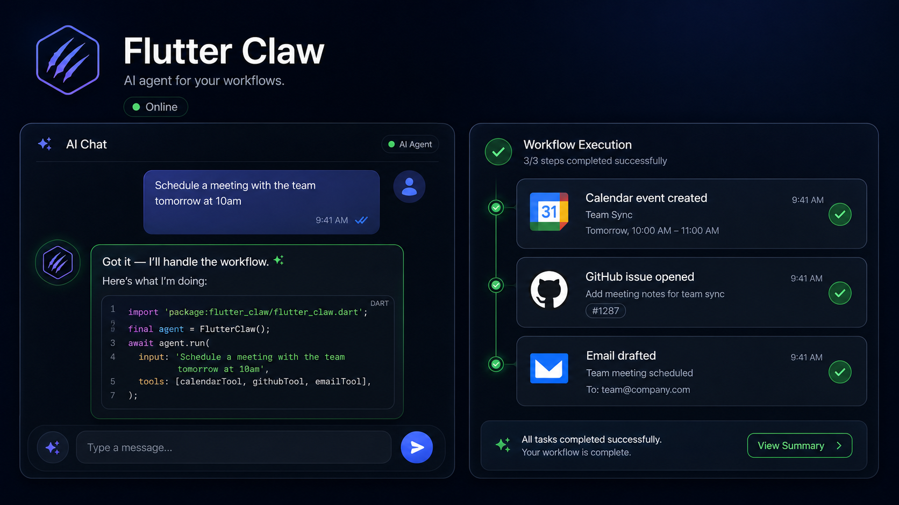

# Flutter Claw

**Open-source Flutter AI agent framework.** Give any Flutter app a brain — tool calling, memory, and multi-modal reasoning in one import.



[](LICENSE)
[](https://flutter.dev)
[](https://github.com/dan-labs-agi/flutter-claw/stargazers)

## Why Flutter Claw?

Building an AI agent app in Flutter used to mean weeks of boilerplate. Flutter Claw turns it into a single import. It's the missing piece between Hermes Agent / OpenClaw (desktop/server) and a real mobile-native agent runtime.

```dart
import 'package:flutter_claw/flutter_claw.dart';

final agent = ClawAgent(
  system: "You are a helpful assistant with access to the user's apps.",
  tools: [
    CameraTool(),         // native camera + vision
    CalendarTool(),       // read/write device calendar
    ComposioBridge(),     // 1000+ apps via Composio
    MemoryTool(),         // persistent conversation memory
  ],
);
```

That's it. You get:
- **Tool calling** — same architecture as Claude Code / Hermes Agent
- **Memory** — conversation history + user context, persistent across sessions
- **Multi-modal** — camera, mic, on-device vision, voice
- **1000+ apps** — bridge to Composio for Gmail, Slack, Notion, Stripe, etc.
- **Mobile-first** — built for Flutter, not retrofitted from a desktop SDK

## Comparison

| Feature | Flutter Claw | OpenClaw | Custom SDK |
|---------|-------------|----------|------------|
| Native iOS/Android | ✅ | ❌ desktop | DIY |
| Multi-modal (camera/audio) | ✅ native | ❌ | DIY |
| Tool calling | ✅ | ✅ | DIY |
| Persistent memory | ✅ | ✅ | DIY |
| 1000+ apps (Composio) | ✅ one line | ❌ | DIY |
| Time to first agent | <10 min | ~1 week | 2-6 months |
| License | MIT | MIT | varies |

## Quickstart

```bash
flutter pub add flutter_claw
```

```dart
import 'package:flutter_claw/flutter_claw.dart';
import 'package:flutter_claw/composio.dart';

void main() async {
  await Composio.init(apiKey: 'YOUR_COMPOSIO_KEY');

  final agent = ClawAgent(
    tools: [CameraTool(), CalendarTool(), ComposioBridge()],
  );

  final response = await agent.run("What's on my calendar today?");
  print(response.text);
}
```

## Use cases

- **Personal AI assistants** — voice + camera + calendar/Gmail bridge
- **Field service apps** — agent that reads the world through the camera
- **Indie productivity tools** — agent-powered email, scheduling, CRM
- **AI glasses apps** — see [danlab.dev](https://danlab.dev) — the glasses stack is built on Flutter Claw

## Pricing

**Free (MIT)** — core framework, all current features, forever.

**Founder's Access — $49/mo** — early access to v0.2-v0.4 (memory graph, voice loop, graph orchestration), priority Discord support, direct line to the team, name in the README. Cancel anytime. *(Stripe checkout opening soon — star the repo for the launch notification.)*

**Enterprise** — custom integrations, on-prem deployments, SLA. Contact: founders@danlab.dev.

## Built On

- **Hermes Agent** — graph-loop orchestration, subagent delegation
- **Composio** — 1000+ app integrations with one tool call
- **Open source** — MIT licensed. Use it in your app today.

## Roadmap

- [x] v0.1 — Core agent + tool calling
- [ ] v0.2 — Memory graph + persistent context *(Founder's Access)*
- [ ] v0.3 — Voice-first loop (STT → agent → TTS) *(Founder's Access)*
- [ ] v0.4 — Graph loop orchestration *(Founder's Access)*
- [ ] v1.0 — Full Hermes Agent parity + Flutter-native UI

## Get involved

- ⭐ Star this repo (it helps more devs find us)
- 🐛 [Open an issue](https://github.com/dan-labs-agi/flutter-claw/issues) for bugs / feature requests
- 💬 Join the Discord (link coming with v0.2)
- 📝 Read the [blog series](https://danlab.dev/blog) for deep dives

## Built by

**[danlab.dev](https://danlab.dev)** — AI glasses + agent stack. We are building the future of human-first computing.

## License

MIT © danlab.dev
